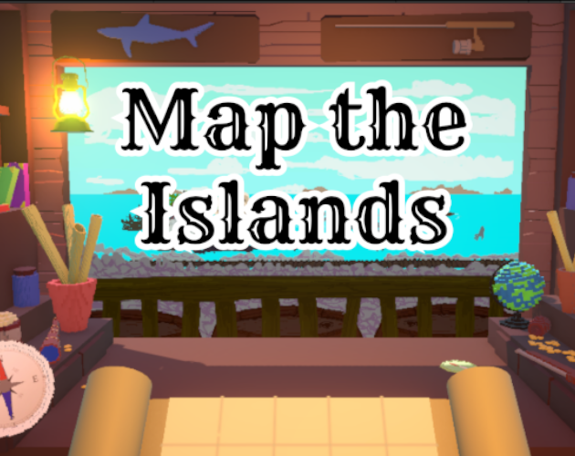

# 🗺️ Map the Islands

<p align="center">
  
</p>

<p align="center">
  <a href="https://ruhan07.itch.io/map-the-islands">
    
  </a>
  
  
</p>

> *Fill a blank map using the accounts of strangers.*

As a cartographer, your task is to shape your blank parchment based on the reports provided by sailors. Each day, three sailors visit your shop and share their previous routes to provide clues about the world's layout. The routes you provide result in either a new discovery or the loss of an information source.

---

## 🎮 Core Mechanics

- **Mapping** — Record geographic locations and hazards using the sailors' verbal reports
- **Navigation** — Issue two directional commands to each sailor to guide them to their desired destination
- **Risk & Reward** — Successfully directing sailors yields higher scores; sending them into unknown regions may result in their death
- **Loop** — Surviving sailors return the following day to report what they encountered and request a new destination

---

## 📥 Play Now

| Platform | Link |
|----------|------|
| 🌐 Web Build | [ruhan07.itch.io/map-the-islands](https://ruhan07.itch.io/map-the-islands) |
| 🪟 Windows | [ruhan07.itch.io/map-the-islands](https://ruhan07.itch.io/map-the-islands) |

---

## 🛠️ Built With

- **Engine:** Unity 6000.0.59f2
- **Render Pipeline:** Universal Render Pipeline (URP)
- **Language:** C# 9.0
- **Packages:** DOTween, Lean Pool

---

## 👥 Contributors

| Name | Role |
|------|------|
| Mustafa Kaan Güngör | Unity Developer |
| Abdülhamid Uysal | Unity Developer |
| Ozan Canbasa | 3D Artist |
| Talha Candan | Pixel Artist |
| Muhammet Hamza Okumuş | Pixel Artist |
| Onurhan Karabağ | Music |

---

## 📅 Made at

**Tedujam 2026** — 48 Hour Game Jam

---

## 📄 License

This project is licensed under the MIT License — see the [LICENSE](LICENSE) file for details.

```
MIT License

Copyright (c) 2026 Map the Islands Team

Permission is hereby granted, free of charge, to any person obtaining a copy
of this software and associated documentation files (the "Software"), to deal
in the Software without restriction, including without limitation the rights
to use, copy, modify, merge, publish, distribute, sublicense, and/or sell
copies of the Software, and to permit persons to whom the Software is
furnished to do so, subject to the following conditions:

The above copyright notice and this permission notice shall be included in all
copies or substantial portions of the Software.

THE SOFTWARE IS PROVIDED "AS IS", WITHOUT WARRANTY OF ANY KIND, EXPRESS OR
IMPLIED, INCLUDING BUT NOT LIMITED TO THE WARRANTIES OF MERCHANTABILITY,
FITNESS FOR A PARTICULAR PURPOSE AND NONINFRINGEMENT. IN NO EVENT SHALL THE
AUTHORS OR COPYRIGHT HOLDERS BE LIABLE FOR ANY CLAIM, DAMAGES OR OTHER
LIABILITY, WHETHER IN AN ACTION OF CONTRACT, TORT OR OTHERWISE, ARISING FROM,
OUT OF OR IN CONNECTION WITH THE SOFTWARE OR THE USE OR OTHER DEALINGS IN THE
SOFTWARE.
```

---

<p align="center">
  <i>Thank you for playing!</i> 🧭⛵
</p>
